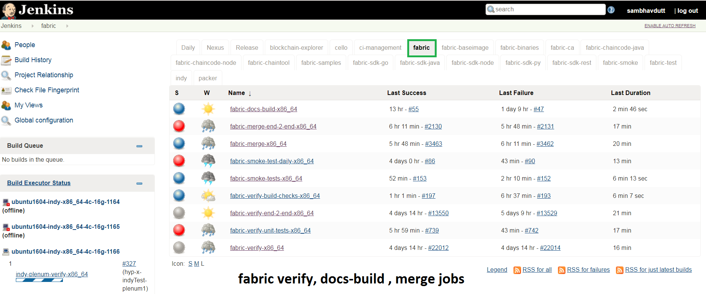
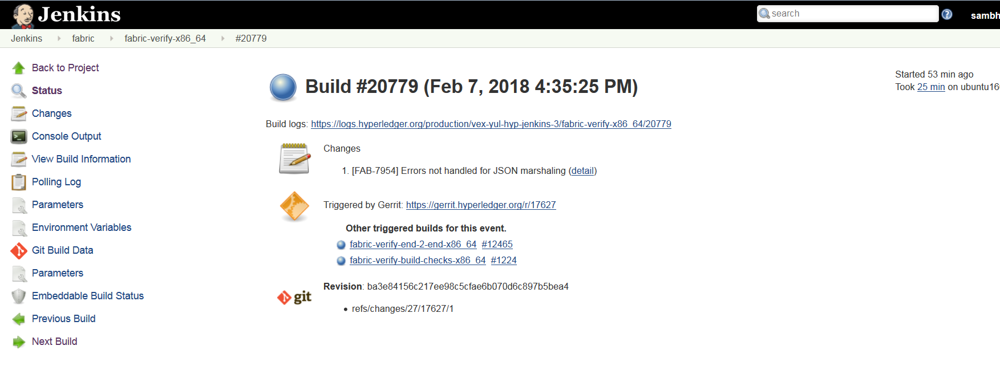

Fabric
======

This document explains the CI process for the **Fabric** repository. The below steps
explains what CI follows or executes when a patch set is submited to the Fabric repository.

Whenever a patchset is submitted to the Fabric repository, Jenkins
triggers the CI build process to test and validate the patchset. Fabric
CI **verify and merge** jobs are configured to test the patchset in the
below environment.

The Hyperledger Fabric (and associated) projects utilize various tools
and workflows for continuous project development. The Fabric CI is
currently utilizing the following versions in the **Master** and
**Release-1.1**, **Release-1.0** branches.

**Master:**

-  GO version:(e.g. v1.10)
   https://github.com/hyperledger/fabric/blob/master/ci.properties

-  DOCKER version: 17.12.0-ce

-  baseimage version:(e.g. 0.4.6)
   https://github.com/hyperledger/fabric/blob/196c0de7c1618952a8f342e406a1021203845eba/Makefile#L46

**Release-1.0:**

-  GO version:(e.g. v1.7.5)
   https://github.com/hyperledger/fabric/blob/release-1.0/ci.properties

-  DOCKER version: 17.12.0-ce

-  baseimage version:(e.g. 0.4.6)

**Release-1.1:**

-  GO version:(e.g. v1.9.2)
   https://github.com/hyperledger/fabric/blob/release-1.1/ci.properties

-  DOCKER version: 17.12.0-ce

-  baseimage version:(e.g. 0.4.6)
   https://github.com/hyperledger/fabric/blob/da14b6bae4a843dfb3fcece5a08ae0ea18488a7a/Makefile#L39

If you would like to know more details on the tool versions, you can refer from any of the Fabric
jobs listed over here `Fabric <https://jenkins.hyperledger.org/view/fabric/>`__, select one of the
jobs, Click on any build number in the bottom left and view the output for details.

There are several job types that are common across Hyperledger Fabric projects. In some cases,
you may or may not see all of the common job types in every project. This depends on the specific
needs of that Hyperledger Fabric project. The CI configuration is prepared in Jenkins
Job Builder to create, update and modify the Jenkins Jobs.

As part of the CI process, we create JJBs (Jenkins Job Builder) in YAML format to configure Jenkins
jobs. JJB has a flexible template system, so creating multiple jobs with a common configuration
which is easy. More details about Jenkins Job Builder are available in `the JJB
webpage <https://docs.openstack.org/infra/jenkins-job-builder/>`__.

Fabric CI Build Process
^^^^^^^^^^^^^^^^^^^^^^^

When a patchset is submitted to the `Fabric <https://jenkins.hyperledger.org/view/fabric/>`__
repository, the Hyperledger Community CI server (Jenkins) triggers **Verify** jobs on **x86_64**
platform using the patchset’s parent commit which may or may not be the latest commit on **Fabric**.

The Fabric **verify** build process is split up into multiple jobs. The initial job
(fabric-verify-build-checks-x86_64) is to build and publish docker images and binaries to
Nexus3 and Nexus2. These images are later pulled/downloaded in the downstream jobs, when the
triggered conditions are met in ``fabric-verify-build-checks-x86_64`` CI job.

The relevant CI jobs are triggered depending on conditions in the patchset:

  - ``Test-1. fabric-verify-build-checks-x86_64`` job triggers when a
    ``patchset`` is created and it validates the patchsets git commit message.

   -  If the commit message has a WIP, the above build job **ignores**
      to build the patchset and will not post a voting back to Fabric
      patchset. That means, this job skips the build process. You can see “WIP - No build” in the
      patchset’s result.

   -  If the patchset has a **non WIP** in the commit
      message or if it is a **documentation change** with these file
      extensions (.rst, .md, .py, .png,.css,.html and .ini), the above
      job posts ``Run DocBuild`` comment and sends Fabric voting as
      ``F1-VerifyBuild=+1 F2-SmokeTest=+1 F3-UnitTest=+1`` against the
      patchset.

      ::

           * Test-2. 
           * Run DocBuild
               - This comment triggers `fabric-docs-build-x86_64` CI job. Once the doc build is
                 successfully executed, Jenkins sends Fabric vote as `F2-DocsBuild=+1` otherwise as
                 `F2-DocsBuild=-1`

   -  If the patchset has **non WIP** in the commit message or a **code and documentation changes**
      (see the above file extensions), fabric-verify-build-checks-x86_64 executes the below flow.
      The below flow also applies to the **code only** patchset excluding documentation build process.

      ::

           * Executes `make basic-checks`, `make docker` (builds, re-tag and publish images to nexus3),
             `make dist` (builds binaries) and publishes to nexus2. If any of these make targets
             fails, fabric-verify-build-checks-x86_64 sends `F1-VerifyBuild=-1` to the Fabric
             patchset otherwise it sends `F1-VerifyBuild=+1` and triggers **DocsBuild** and
             **SmokeTest** jobs parallely by posting below comments to the patchset.

           * Run DocsBuild
               - This comment triggers `fabric-docs-build-x86_64` job and posts `F2-DocsBuild=+1`
                 if successful, otherwise `F2-DocsBuild=-1`. See the doc RTD output in the nexus
                  log server.

                  What happens in **fabric-docs-build-x86_64** job

                   Step1: Builds the documentation changes:
                      - Extracts the documentation files(.md, .rst, .txt, .py,
                       .png, .css, .html & .ini) from the patchset submitted and builds the
                        documentation after verification checks like syntax, and tox verification.
                        This job is triggered only when a patchset contains documentation files.

                   Step2: Documented output is published to Nexus:
                      - Once the documentation build is successful, it is archived, and the archives
                        built are published to Nexus.

           * Test-3.
           * Run SmokeTest
               - This comment triggers `fabric-smoke-tests-x86_64` job and posts `F2-SmokeTest=+1`
                 to the patchset and triggers Unit-Test job by posting `Run UnitTest` comment if
                 successful, otherwise posts `F2-SmokeTest=-1` which doesn't trigger Unit-Test job.
               
           * Test-4. 
           * Run UnitTest
               - This comment triggers `fabric-verify-unit-tests-x86_64` job and posts
                 `F3-UnitTest=+1` vote against the patchset if successful, otherwise `F3-UnitTest=-1`. 
                 
           * Run IntegrationTest
               - This comment triggers the `fabric-verify-integration-tests-x86_64` job that executes
                 the Integration tests.
                 (The Integration Test is currently disabled for now.)
                 
Conditions to merge the patch set
^^^^^^^^^^^^^^^^^^^^^^^^^^^^^^^^^^

Maintainers have to look for +1 on all the labels before they merge the patchsets. The votes on the
patchset should look like below.

.. code:: shell

    F1-VerifyBuild     +1 Hyperledger Jobbuilder
    F2-DocBuild        +1 Hyperledger Jobbuilder
    F2-SmokeTest       +1 Hyperledger Jobbuilder
    F3-IntegrationTest +1 Hyperledger Jobbuilder
    F3-UnitTest        +1 Hyperledger Jobbuilder

A patchset is not elible to merge, if it even gets a single -1.

Merge process for Fabric
^^^^^^^^^^^^^^^^^^^^^^^^

Once the patchset is approved by CI and the maintainers, they will merge the patchset which triggers
below **Merge** jobs on the latest Fabric commit (doesn’t use the patchset’s parent commit).

**fabric-merge-end-2-end-x86_64:**
https://jenkins.hyperledger.org/view/fabric/job/fabric-merge-end-2-end-x86_64/

Step1: Clones the fabric-ca repository:

-  Clones the latest commit from the Fabric fabric-ca repository and
   then checksout the branch associated with the patchset. If the patchset is triggered on
   fabric-ca release-1.1 branch, script will checkout to release-1.1
   branch.

-  After the fabric-ca repository is cloned in the above step, the CI script proceeds to build the
   docker images that will be used to run the end-to-end (e2e) tests

Step 2: Executes the e2e tests:

Below are the tests triggers in Fabric e2e job:

-
   1. e2e-cli - Runs fabric/examples/e2e_cli tests.

      -  Executes the network_setup.sh that spins up the network with
         docker-compose file from fabric/examples/e2e_cli folder.

-
   2. e2e-node - Runs the sdk-node e2e tests (Executes **gulp test**
      command).

      -  Clones fabric-sdk-node repository and will checkout to Branch
      -  Spins up network using the docker-compose file from
         test/fixtures folder
      -  Install nodejs 8.9.4 version
      -  RUN
         ``istanbul cover --report cobertura test/integration/e2e.js``

-
   3. e2e-java - Runs e2e java integration tests.

      -  If the patchset is on release-1.0 branch, CI skips the java e2e
         tests for now. TODO# mention the JIRA FAB here.
      -  If not, run the java e2e tests by executing ``source cirun.sh``

-
   4. byfn and efyn - Runs byfn and eyfn tests with default, custom channel, couchdb and nodejs chaincode and fabric-ca sample tests.
         see the CI script here https://github.com/hyperledger/ci-management/blob/master/jjb/fabric-samples/shell/include-raw-fabric-samples-byfn-e2e.sh

-
   5. After the above tests have worked as expected, merge job publishes images and binaries
      to nexus repository with "stable" image tag.

      TODO# Script will be pushed to fabric repository to download these images and binaries.

**fabric-merge-x86_64:**
https://jenkins.hyperledger.org/view/fabric/job/fabric-merge-x86_64

Step1: Pulls the third party docker images:

-  Pulls the fabric baseimage version third party docker images (kafka, zookeeper, couchdb).
   The image name is appended with ‘hyperledger’ and tagged with the latest tag.

Step2: Executes Fabric tests using below two commands:

    ``make linter`` See the make linter target in fabric/Makefile
      ( https://github.com/hyperledger/fabric/blob/master/Makefile#L206 )
    ``make unit-test`` See the make unit-test target in fabric/Makefile
      ( https://github.com/hyperledger/fabric/blob/master/Makefile#L184 )

After the verify or merge tests are executed, It is time to archive the
logs (artifacts). CI publishes the logs(artifacts) on Jenkins console.

Build Notifications
^^^^^^^^^^^^^^^^^^^^

The build results can be viewed on the Jenkins console, where depending on the result it displays
with a colored bubble (green for success, red for failure). See the build results on Jenkins console
(Jenkins Console)[https://jenkins.hyperledger.org/view/fabric/]

Trigger failed jobs through Gerrit comments
^^^^^^^^^^^^^^^^^^^^^^^^^^^^^^^^^^^^^^^^^^^

Re-trigger of builds is possible in Jenkins by entering a comment to the Gerrit change that
re-triggers a specific verify job. To do so, follow the below process:

Step 1: Open the Gerrit patchset for which you want to reverify the build

Step 2: Click on **Reply**, then type one of the below comments and click **Post**.

    ``VerifyBuild``         - Triggers fabric-verify-build-checks-x86_64 CI job, the developers have to check
                              the result of this job before posting the below comments on the patchset. As mentioned above,
                              this job publishes images and binaries to nexus which further downloaded by SmokeTest and UnitTest
                              jobs. Please make sure, images and binaries are published for that sepecific commit.

-   ``Run SmokeTest``       – Triggers fabric-smoke-tests-x86_64.
   
-   ``Run IntegrationTest`` – Triggers fabric-verify-integration-tests-x86_64.

-   ``Run UnitTest``        – Triggers fabric-verify-unit-tests-x86_64.

-   ``Run DocsBuild``       – Triggers fabric-docs-build-x86_64

This kicks off the specified Fabric verify jobs. Once the build is triggered, verify the Jenkins
console output and go through the log messages if you are interested to know how the build is making
progress.

Questions
^^^^^^^^^

Please reach out to us in https://chat.hyperledger.org/channel/ci-pipeline or
https://chat.hyperledger.org/channel/fabric-ci RC channels for any questions.
